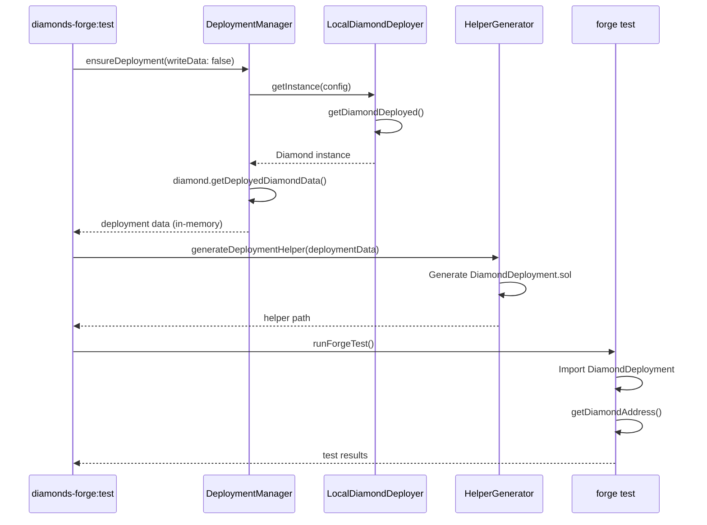

# PRD: Complete diamonds-hardhat-foundry Module Implementation

## Introduction/Overview

The `@diamondslab/diamonds-hardhat-foundry` module provides TypeScript-based Hardhat tasks and Solidity helpers to enable Foundry-based testing of Diamond contracts deployed via `@diamondslab/diamonds` and `@diamondslab/hardhat-diamonds`. Currently, the module has partial functionality but suffers from critical issues:

1. **Hardcoded addresses in helpers**: DiamondDeployment.sol contains static addresses from old deployments
2. **Incomplete integration tests**: Module's own tests are placeholder stubs
3. **No snapshot/restore support**: Unlike Hardhat tests, Forge tests can't easily reuse deployments
4. **Unclear deployment persistence**: No clear control over when deployment records are written

**Goal**: Complete the module to provide a production-ready testing framework that supports both ephemeral (snapshot/restore) and persistent deployment workflows, with comprehensive integration tests validating all functionality.

## Goals

1. **Dynamic Helper Generation**: Generate DiamondDeployment.sol at test runtime with actual deployed addresses
2. **Flexible Testing Workflows**: Support one-off test runs, persistent development, and CI/CD automation
3. **Comprehensive Integration Tests**: Validate deployment, helper generation, ABI loading, and upgrade processes
4. **Snapshot/Restore Capability**: Enable efficient test iteration like Hardhat's snapshot mechanism
5. **Clear Documentation**: Provide usage patterns for all supported workflows

## User Stories

### Story 1: Developer Running Quick Tests

As a developer, I want to run `npx hardhat diamonds-forge:test` and have the Diamond deployed fresh, helpers generated with real addresses, and tests execute successfully without leaving stale deployment files.

**Acceptance Criteria**:

- Command deploys Diamond to ephemeral network
- DiamondDeployment.sol generated with actual addresses
- Tests access Diamond via helper
- No deployment files written to disk (unless `--save-deployment` flag used)
- Can run multiple times without conflicts

### Story 2: Developer Testing with Persistent Deployment

As a developer, I want to deploy once with `--save-deployment`, then run tests multiple times against the same Diamond instance using snapshots to reset state between test runs.

**Acceptance Criteria**:

- `npx hardhat diamonds-forge:deploy --save-deployment` creates persistent deployment
- Subsequent `npx hardhat diamonds-forge:test` reuses existing deployment
- Tests can snapshot/restore blockchain state between runs
- Helpers always reflect current deployment addresses

### Story 3: Developer Testing Upgrades

As a developer, I want to test Diamond upgrade scenarios where DiamondDeployment.sol is regenerated after each upgrade to reflect new facet addresses.

**Acceptance Criteria**:

- Tests can trigger facet upgrades
- Helper regeneration occurs after upgrade
- Tests verify new facet addresses are accessible
- Both before/after upgrade states can be tested

### Story 4: CI/CD Automated Testing

As a DevOps engineer, I want a single command that deploys, generates helpers, and runs all tests in a clean environment for continuous integration.

**Acceptance Criteria**:

- `npx hardhat diamonds-forge:test` works in CI without manual setup
- No external state required (no hardhat node, no anvil)
- Exit code reflects test pass/fail
- Can run in parallel CI jobs without conflicts

### Story 5: Module Developer Validating Functionality

As a module contributor, I want comprehensive integration tests that validate the deployment manager, helper generator, ABI loader, and fuzzing framework work correctly together.

**Acceptance Criteria**:

- All integration tests in `test/foundry/integration/diamonds-hardhat-foundry/` pass
- Tests cover: deployment, helper generation, ABI loading, end-to-end workflow
- Tests validate both successful and error cases
- Tests can run independently or as a suite

## Functional Requirements

### 1. Dynamic Helper Generation

**1.1** The `HelperGenerator` MUST regenerate `DiamondDeployment.sol` before each test run with addresses from the current deployment

**1.2** Generated helper MUST include:

- Diamond proxy address from `diamond.getDeployedDiamondData().DiamondAddress`
- All facet addresses from `diamond.getDeployedDiamondData().DeployedFacets`
- Deployer address from `diamond.getDeployedDiamondData().DeployerAddress`
- Generation timestamp and source deployment file path

**1.3** Helper MUST use Solidity `library` pattern with `internal pure` functions for address getters

**1.4** Helper MUST NOT contain hardcoded addresses - all values derived from deployment data

**1.5** Generation MUST occur in `ForgeFuzzingFramework.runTests()` before running Forge tests

### 2. Deployment Management

**2.1** `DeploymentManager.ensureDeployment()` MUST accept `writeDeployedDiamondData` parameter

**2.2** When `writeDeployedDiamondData: false`:

- Deploy Diamond using `LocalDiamondDeployer.getDiamondDeployed()`
- Do NOT write deployment JSON to `diamonds/{name}/deployments/`
- Deployment data available in memory via `diamond.getDeployedDiamondData()`

**2.3** When `writeDeployedDiamondData: true`:

- Deploy Diamond and write deployment record
- Subsequent runs can reuse deployment via `getDeployment()`

**2.4** `diamonds-forge:test` task MUST default to `writeDeployedDiamondData: false`

**2.5** `diamonds-forge:test --save-deployment` MUST set `writeDeployedDiamondData: true`

**2.6** `diamonds-forge:deploy` task MUST default to `writeDeployedDiamondData: true`

### 3. Snapshot/Restore Support

**3.1** When using persistent deployment (`--save-deployment`), tests SHOULD support EVM snapshots

**3.2** `ForgeFuzzingFramework` MUST detect if network supports snapshots (localhost/hardhat with running node)

**3.3** Before running tests, take snapshot via `provider.send("evm_snapshot", [])`

**3.4** After each test suite, restore snapshot via `provider.send("evm_revert", [snapshotId])`

**3.5** Provide Solidity helper in `DiamondForgeHelpers.sol`:

```solidity
function snapshotState() internal returns (uint256 snapshotId);
function revertToSnapshot(uint256 snapshotId) internal;
```

### 4. Integration Tests

**4.1** `test/foundry/integration/diamonds-hardhat-foundry/deployment.t.sol` MUST:

- Test `DeploymentManager.deploy()` creates valid Diamond
- Verify deployment data includes all required fields
- Test Diamond address has code deployed
- Test all facets have code deployed
- Verify ABI file is generated

**4.2** `test/foundry/integration/diamonds-hardhat-foundry/helper-generation.t.sol` MUST:

- Test `HelperGenerator` creates `DiamondDeployment.sol`
- Verify generated file compiles
- Test `getDiamondAddress()` returns correct address
- Test `getFacetAddress()` returns correct facet addresses
- Verify deployer address is accessible

**4.3** `test/foundry/integration/diamonds-hardhat-foundry/end-to-end.t.sol` MUST:

- Test complete workflow: deploy → generate helpers → run tests
- Test with `writeDeployedDiamondData: false` (ephemeral)
- Test with `writeDeployedDiamondData: true` (persistent)
- Test helper regeneration after facet upgrade
- Verify cleanup after test run

**4.4** `test/foundry/helpers/DiamondABILoader.t.sol` MUST:

- Test loading Diamond ABI from `diamond-abi/ExampleDiamond.json`
- Test extracting function selectors
- Test extracting function signatures
- Test selector-signature correspondence
- Test `verifySelectorsMatch()` with on-chain Diamond

**4.5** `test/foundry/poc/DiamondABIDebugTest.t.sol` MUST:

- Test JSON parsing of ABI structure
- Test handling of functions with no inputs
- Test handling of functions with multiple inputs
- Verify no reverts during extraction

**4.6** `test/foundry/integration/ExampleIntegration.t.sol` MUST:

- Load Diamond via `DiamondDeployment.getDiamondAddress()`
- Test multi-facet interaction workflow
- Test cross-facet state management
- Use `DiamondForgeHelpers.assertValidDiamond()`

**4.7** `test/foundry/integration/BasicDiamondIntegration.t.sol` MUST:

- Deploy its own Diamond in `setUp()` (self-contained test)
- Test Diamond initialization
- Test facet introspection
- Test ownership transfer
- Serve as example of self-deploying test pattern

**4.8** `test/foundry/integration/BasicDiamondIntegrationDeployed.t.sol` MUST:

- Extend `DiamondFuzzBase`
- Load Diamond from deployment
- Test deployed Diamond exists and has code
- Test facet introspection on deployed instance
- Test owner functionality
- Test selector enumeration
- Test gas measurement
- Test simulated upgrade scenario

### 5. Task Updates

**5.1** Update `diamonds-forge:test` task:

```typescript
.addFlag("saveDeployment", "Write deployment data to file for reuse")
.addFlag("useSnapshot", "Use EVM snapshots for test isolation (requires persistent deployment)")
```

**5.2** Task MUST pass `writeDeployedDiamondData` to `DeploymentManager`:

```typescript
const writeDeployment = taskArgs.saveDeployment ?? false;
```

**5.3** Task MUST regenerate helpers with actual deployment data before running tests

**5.4** Task MUST clean up ephemeral deployments if `saveDeployment: false`

### 6. Error Handling

**6.1** If Diamond deployment fails, MUST provide clear error with troubleshooting steps

**6.2** If helper generation fails, MUST show which deployment data is missing

**6.3** If Forge tests fail due to missing Diamond, MUST suggest using `--save-deployment` or checking network

**6.4** If snapshot fails, MUST fall back to non-snapshot mode with warning

## Non-Goals (Out of Scope)

1. **Mainnet testing**: Module focuses on local/testnet, not mainnet fork testing
2. **Alternative testing frameworks**: Only Foundry supported, not Hardhat tests
3. **Diamond deployment strategies**: Uses existing `LocalDiamondDeployer`, no new deployers
4. **Custom ABI formats**: Only supports standard Hardhat JSON ABI output
5. **Test result analysis**: No custom reporters, uses Forge's built-in output
6. **Multi-chain deployment**: Single network per test run (handled by hardhat-multichain separately)

## Design Considerations

### Helper Generation Flow



### Snapshot/Restore Pattern

```solidity
// In test setUp()
function setUp() public {
    snapshotId = vm.snapshot();
}

// After each test
function tearDown() public {
    vm.revertTo(snapshotId);
    snapshotId = vm.snapshot(); // Take new snapshot for next test
}
```

### Configuration Hierarchy

```
Task flags override config file
↓
Config file overrides defaults
↓
Defaults: writeDeployedDiamondData = false for tests
```

## Technical Considerations

### LocalDiamondDeployer Integration

- MUST pass `writeDeployedDiamondData` from task → DeploymentManager → LocalDiamondDeployer config
- MUST use `diamond.getDeployedDiamondData()` to retrieve addresses (not file reading)
- MUST NOT cache deployment instances across test runs if `writeDeployedDiamondData: false`

### Helper Template Updates

Current DiamondDeployment.sol template needs:

```solidity
/// @notice Address of the deployer account
/// @dev Account that deployed the Diamond
address constant DEPLOYER_ADDRESS = {{deployerAddress}};

/**
 * @notice Get the deployer address
 * @return The address of the deployer account
 */
function getDeployerAddress() internal pure returns (address) {
    return DEPLOYER_ADDRESS;
}
```

### Test Isolation

- For ephemeral tests: Each run gets fresh deployment (no state sharing)
- For persistent tests: Use snapshots to reset state between runs
- For upgrade tests: Generate new helper after upgrade, tests access both old/new addresses

### Forge Configuration

Update `foundry.toml` for test compatibility:

```toml
[profile.default]
src = "contracts"
out = "artifacts/forge"
libs = ["node_modules", "lib"]
test = "test/foundry"
cache_path = "cache_forge"

# Enable FFI for reading deployment files in tests
ffi = true

# Enable external library linking
libraries = [
    "@diamondslab/diamonds-hardhat-foundry/contracts"
]
```

## Success Metrics

### Module Quality

1. **Test Coverage**: All integration tests pass (8 test files, 0 failures)
2. **Deployment Success Rate**: 100% successful deployments in test runs
3. **Helper Accuracy**: Generated helpers match deployed addresses 100% of time

### Developer Experience

1. **Time to First Test**: New user can run tests within 5 minutes of installation
2. **Test Iteration Speed**: Snapshot/restore enables sub-second test reruns
3. **Error Clarity**: 90% of failures have actionable error messages

### Reliability

1. **CI Success Rate**: Tests pass consistently in CI environment (>99%)
2. **Parallel Test Safety**: Can run multiple test suites simultaneously
3. **State Isolation**: Tests don't interfere with each other

## Open Questions

1. **Snapshot compatibility**: Which Forge/Anvil versions support snapshots? Need version check?
2. **Cleanup strategy**: Should ephemeral deployments clean up artifacts automatically?
3. **Upgrade helper caching**: How to handle multiple helper versions in upgrade tests?
4. **Parallel test runs**: Do we need unique deployment paths per test process?
5. **Network detection**: How to reliably detect if network supports snapshots?

## Implementation Priority Order

### Phase 1: Fix Helper Generation (Critical Path)

- [ ] Update `HelperGenerator.generateDeploymentHelper()` to accept deployment data object
- [ ] Add `deployerAddress` to template
- [ ] Remove hardcoded addresses from template
- [ ] Update template to generate from `DeployedDiamondData`

### Phase 2: Fix Deployment Management

- [ ] Add `writeDeployedDiamondData` parameter to `DeploymentManager.ensureDeployment()`
- [ ] Pass config through to `LocalDiamondDeployer`
- [ ] Update task to pass `saveDeployment` flag
- [ ] Test ephemeral vs persistent deployment

### Phase 3: Complete Integration Tests

- [ ] Implement `deployment.t.sol` - test DeploymentManager
- [ ] Implement `helper-generation.t.sol` - test HelperGenerator
- [ ] Implement `end-to-end.t.sol` - test full workflow
- [ ] Update `BasicDiamondIntegrationDeployed.t.sol` - use DiamondFuzzBase correctly
- [ ] Update `ExampleIntegration.t.sol` - use generated helpers

### Phase 4: Add Snapshot Support

- [ ] Implement snapshot helpers in `DiamondForgeHelpers.sol`
- [ ] Add `--use-snapshot` flag to test task
- [ ] Update framework to take/restore snapshots
- [ ] Document snapshot workflow

### Phase 5: Documentation and Examples

- [ ] Update README with all workflow examples
- [ ] Create TESTING.md with best practices
- [ ] Add inline comments to generated helpers
- [ ] Create migration guide from old prototype

## Acceptance Criteria

**The diamonds-hardhat-foundry module is complete when**:

1. ✅ Running `npx hardhat diamonds-forge:test` deploys Diamond, generates helpers with real addresses, and all tests pass
2. ✅ Running `npx hardhat diamonds-forge:test --save-deployment` creates persistent deployment and helpers
3. ✅ All 8 integration test files execute successfully with real Diamond deployments
4. ✅ Generated `DiamondDeployment.sol` contains no hardcoded addresses
5. ✅ Tests can snapshot/restore state when using persistent deployments
6. ✅ Module works in CI/CD without manual setup
7. ✅ Documentation clearly explains all supported workflows
8. ✅ Error messages guide users to solutions

## Notes

- This PRD builds on existing migration work in `prd-migrate-localdiamonddeployer.md`
- Focus is completing what was started, not redesigning architecture
- Priority is getting tests working, then optimizing performance
- Snapshot support is nice-to-have, not blocking for Phase 1-3
